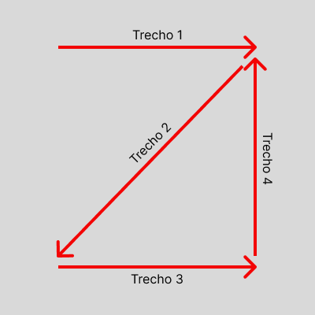
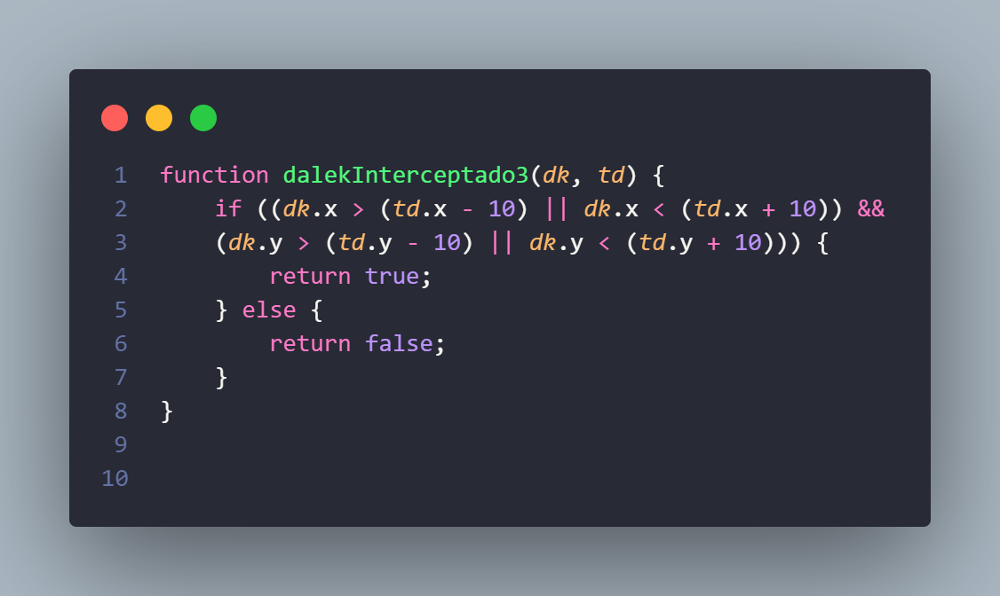
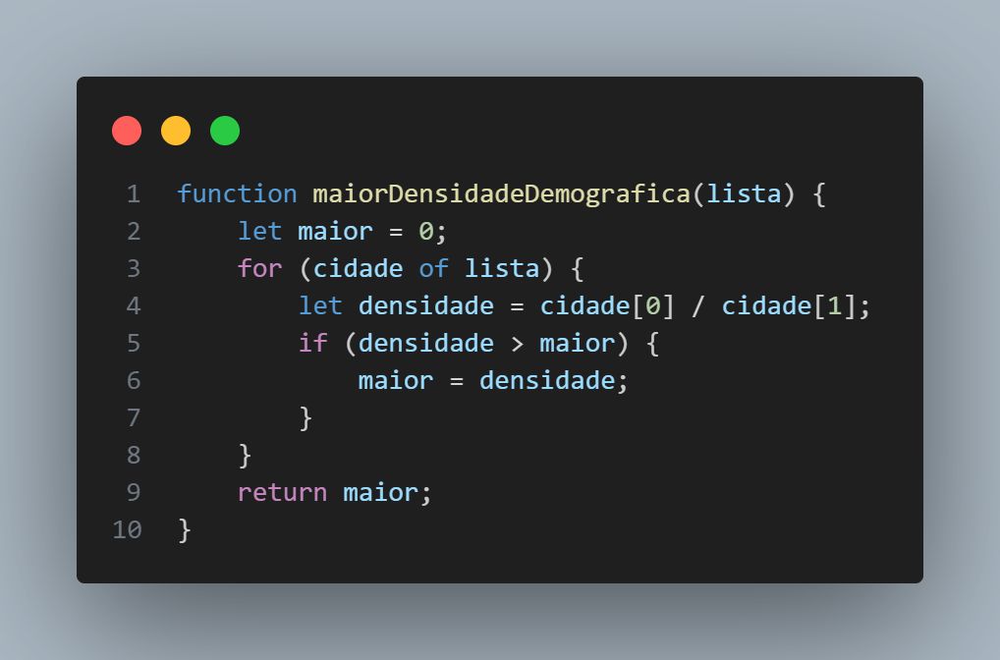
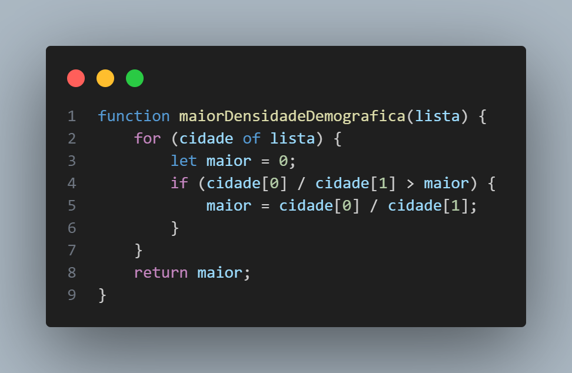

## Questão 1
O seguinte script faz parte de uma cena, e está diretamente relacionado à movimentação de um personagem. Independente do local inicial em que ele se encontra, indique qual alternativa representa a sua trajetória, simbolizada pelos TRECHOS de 1 até 4:

```JavaScript
var estado;
var velocidade = 100;
var passos = 0;
const MOVIMENTO = {
    TRECHO1: 0, TRECHO2: 1, TRECHO3: 2, TRECHO4: 3
};
var player;

function preload() {
    this.load.image('player', './assets/player.png');
}

function create() {
    estado = MOVIMENTO.TRECHO1;
    player = this.physics.add.sprite(450, 200, 'player');
}

function update() {
    var vetor_movimento = new Phaser.Math.Vector2(0, 0);

    if (estado === MOVIMENTO.TRECHO1) {
        vetor_movimento.x -= 1;
        if (passos >= 100) {
            estado = MOVIMENTO.TRECHO2;
            passos = 0;
        }
    } else if (estado === MOVIMENTO.TRECHO2) {
        vetor_movimento.y += 1;
        if (passos >= 100) {
            estado = MOVIMENTO.TRECHO3;
            passos = 0;
        }
    } else if (estado === MOVIMENTO.TRECHO3) {
        vetor_movimento.x += 1;
        if (passos > 100) {
            estado = MOVIMENTO.TRECHO4;
            passos = 0;
        }
    } else if (estado === MOVIMENTO.TRECHO4) {
        vetor_movimento.x -= 1;
        vetor_movimento.y -= 1;
        if (passos > 100) {
            estado = MOVIMENTO.TRECHO2;
            passos = 0;
        }
    }
    passos += 1;

    player.setVelocity(vetor_movimento.x * velocidade, vetor_movimento.y * velocidade);
}
```

### Alternativas

|  |             |          |                    |
|-------|-----------------|--------------------|------------|
| A)    |  | B)    |  |
| C)    |  | D)    |  |
| E)    |  |

<details>
  <summary>Resposta e Explicações</summary>

  ### Alternativa C
  
  - Observa-se que a alternativa A está incorreta logo no Trecho 1, no qual o personagem se dirige à direita, enquanto no código ele se dirigiria verdadeiramente à esquerda.
 
  - A alternativa B está incorreta porque o Trecho 4 movimenta o personagem apenas para cima (decrementando `y`), mas no código este trecho movimenta o personagem na diagonal para a esquerda (decrementando `x` e `y`).
 
  - A alternativa D está incorreta porque o Trecho 3 não possui o mesmo tamanho dos demais, e o código mostra que cada trecho possui o mesmo comprimento (100 passos do personagem).
 
  - A alternativa E está incorreta pela mesma lógica da alternativa A: o personagem não começa se movimentando para a direita no Trecho 1, e sim para a esquerda.

</details>

<br><br>

## Questão 2
Um guardião de alguma galáxia precisa caçar e desativar seres malignos, os DALEKs. Para isso, ele usa uma nave chamada TARDIS (Time And Relative Dimensions In Space) que viaja para qualquer lugar no tempo e espaço. A TARDIS é equipada com um sensor capaz de detectar um DALEK em até 10m de distância. 

Considere o trecho de código abaixo, que representa uma rotina de busca, interceptação e captura de DALEKs e escolha a alternativa que represente corretamente uma função 'dalekInterceptado' que retorne verdadeiro ou falso caso a TARDIS intercepte um DALEK para poder capturá-lo. 

- td = TARDIS
- dk = DALEK


### Alternativas

|  |             |          |                    |
|-------|-----------------|--------------------|------------|
| A)    |  | B)    |  |
| C)    |  | D)    |  |
| E)    |  |

<details>
  <summary>Resposta e Explicações</summary>

  ### Alternativa D
  
  - A alternativa A é bastante semelhante à correta (D). Porém, ela desconsidera DALEKs que estão exatamente a 10 metros de distância da TARDIS pois não usa os operadores `>=` e `<=`, apenas `>` e `<`. Por isso, só seriam detectados aqueles a nove metros ou menos de distância.
  
  - A alternativa B detecta apenas DALEKs a exatos 10 metros de distância por conta do operador `===` utilizado.
  
  - A alternativa C, ao utilizar o operador `||`, não delimita corretamente o espaço de detecção de DALEKs e permite a interceptação de inimigos a qualquer distância. Isso porque a posição de um DALEK precisa ser maior ou igual a posição da TARDIS - 10 em ambas as direções `x` e `y` (`dk.x >= td.x - 10 && dk.y >= td.y - 10`) **E** (**não OU**) menor ou igual a posição da TARDIS + 10 também em ambas as direções (`dk.x <= td.x + 10 && dk.y <= td.y + 10`).
  
  - A alternativa E está incorreta porque apenas verifica se o DALEK está mais abaixo e mais a direita que a TARDIS, não chega a delimitar a área de detecção.

</details>

<br><br>


## Questão 3
O código abaixo possui um erro bastante comum de alunos de programação: a utilização de códigos desnecessários. Analise o código e marque a resposta que melhor explica o que o código faz e qual o comando desnecessário.
```JavaScript
let num = 100
let soma = 0
let cont = 0

for(let i = 0; i < num; i++) {
	cont+=i
	for(let j = 0; j < num; j++) {
		soma = cont;
	}	    
}
```

### Alternativas

|  |             |          |                    |
|-------|-----------------|--------------------|------------|
| A)    | O algoritmo soma os valores do índice “i” progressivamente. O comando FOR interno é desnecessário, apenas o comando soma=cont era importante. | B)    | O algoritmo soma os valores do índice “i” progressivamente. O comando FOR externo é desnecessário, apenas o comando soma=cont era importante. |
| C)    | O algoritmo soma os valores do índice “i” progressivamente. O código poderia ser substituído por cont=num, dado que a soma sempre será 100. | D)    | Dado que o valor inicial das variáveis “cont” e “soma” são 0, o código sempre resultará em 0. Desta forma basta apenas imprimir a variável soma. |
| E)    | O algoritmo soma os valores do índice “i” progressivamente, imprimindo o resultado a cada iteração do loop. Nenhum código necessita ser removido. |

<details>
  <summary>Resposta e Explicações</summary>

  ### Alternativa A

  - A alternativa B está incorreta porque o comando FOR externo é o responsável pela soma dos índices que está sendo feita, não podendo ser descartado.
  
  - A alternativa C está incorreta porque a soma não será sempre 100, será igual a soma de todos os números de 0 a 100 (100 não incluso).
  
  - A alternativa D está incorreta porque os valores das variáveis `cont` e `soma` são alterados durante a execução do código, não mantendo seu valor inicial 0.
  
  - A alternativa E está incorreta porque não há comando para impressão de resultados e há sim código que deve ser removido. 
  
</details>

<br><br>

## Questão 4
Um código em Javascript foi implementado no objeto “Player”, que controla o sprite de cachorro, na cena abaixo. Considerando que tal código implementado é mostrado mais abaixo, selecione a alternativa que identifique o objetivo dele.


```JavaScript
class MainScene extends Phaser.Scene {
        constructor() {
            super({ key: 'MainScene' });
        }


        preload() {
            this.load.image('i', '../../assets/player.png');
        }


        create() {
            this.p = new Phaser.Math.Vector2(0, 0);
            this.v = 100;
            this.i = this.physics.add.image(this.p.x, this.p.y, 'i');
            this.t = this.input.keyboard.createCursorKeys();
        }


        update(time, delta) {
            let i = new Phaser.Math.Vector2(0, 0);
            if (this.t.right.isDown) {
                i.x += 1;
            }
            if (this.t.left.isDown) {
                i.x -= 1;
            }
            if (this.t.down.isDown) {
                i.y += 1;
            }
            if (this.t.up.isDown) {
                i.y -= 1;
            }


            if (i.length() > 0) {
                i.normalize();
            }

            this.p.x += i.x * this.v * (delta / 500);
            this.p.y += i.y * this.v * (delta / 500);
            this.p.x = Phaser.Math.Clamp(this.p.x, 0, this.game.config.width);
            this.p.y = Phaser.Math.Clamp(this.p.y, 0, this.game.config.height);
        }
    }

```

### Alternativas

|  |             |          |                    |
|-------|-----------------|--------------------|------------|
| A)    | Fazer o cachorro seguir o mouse do jogador. | B)    | Movimentar o cachorro pela tela usando as teclas de seta do teclado. |
| C)    | Movimentar o cachorro até a casa. | D)    | Movimentar o cachorro até o osso. |
| E)    | Movimentar o cachorro até o osso e, após coletá-lo, movimentar o cachorro até a casa. |

<details>
  <summary>Resposta e Explicações</summary>

  ### Alternativa B

  - A alternativa A está incorreta porque os comandos de movimento são estabelecidos nas teclas de seta do teclado, como dita o comando `this.input.keyboard.createCursorKeys()`.
  
  - A alternativa C está incorreta porque o código tem objetivo de movimentar o cachorro de acordo com inputs do teclado, não necessariamente até a casa.
  
  - A alternativa D está incorreta porque o código tem objetivo de movimentar o cachorro de acordo com inputs do teclado, não necessariamente até o osso.
  
  - A alternativa E está incorreta porque o código tem objetivo de movimentar o cachorro de acordo com inputs do teclado, não necessariamente até o osso ou a casa, além de não apresentar uma maneira de coletar o osso.
  
</details>

<br><br>


## Questão 5
Um jogador de SimCity, um simulador de criação de cidades, deseja saber qual das suas metrópoles possui a maior densidade demográfica. Para isso, cada cidade é armazenada em uma lista de apenas dois índices, na qual a primeira posição (`cidade[0]`) conterá o número de habitantes e a segunda posição (`cidade[1]`) conterá a área da cidade em quilômetros quadrados.
Para calcular a densidade demográfica (hab/km²), é necessário dividir a população pela área da cidade.

Estas pequenas listas de cidades serão armazenadas em uma OUTRA lista, que conterá todas as cidades.

Para encontrar a cidade com maior densidade demográfica, o sistema precisa de uma função que irá percorrer esta lista de cidades e retornar o valor da maior densidade demográfica.
Qual das opções abaixo representaria o código adequado para tal função?

|  |             |          |                    |
|-------|-----------------|--------------------|------------|
| A)    |  | B)    |  |
| C)    |  | D)    |  |
| E)    |  |

<details>
  <summary>Resposta e Explicações</summary>

  ### Alternativa A

- A alternativa B está incorreta porque, em primeiro lugar, não é necessário imprimir o valor da densidade demográfica. Além disso, a variável `maior` não foi declarada no código, o que geraria um erro ao tentar utilizá-la.

- A alternativa C está incorreta porque a variável `maior` é declarada dentro do loop FOR, o que faz com que seu valor seja igualado a zero a cada iteração do laço. Além disso, como o valor de `maior` é retornado logo na primeira vez em que se encontra um valor de densidade demográfica maior que o da variável `maior`, não há uma verdadeira comparação de densidades demográficas, apenas é retornada a primeira que seja maior que 0.

- A alternativa D está incorreta porque o valor inicial da variável `maior` pode não ser superado por nenhuma densidade demográfica caso todas sejam menores que dez mil, o que causaria um valor de retorno errado. 

- A alternativa E está incorreta porque a variável `maior` é declarada dentro do loop FOR, o que faz com que seu valor retorne a 0 a cada iteração. Sendo assim, o valor de retorno da função sempre será igual a 0 ou à densidade demográfica da última cidade da lista (caso ela seja maior que 0).
  
</details>


<br><br>


## Questão 6
De acordo com Scott Rogers, no livro "Level up: um guia para o design de grandes jogos", o heads-up display (HUD) é qualquer elemento ou composição na tela que comunique informações importantes ao jogador, auxiliando-o na elaboração e adaptação de estratégias em tempo real.

Para que seu jogo seja mais imersivo, é necessário "fazer seus elementos de HUD se moverem ou desaparecerem da tela enquanto estiverem inativos. Naturalmente, eles precisam reaparecer sempre que necessário (como quando o jogador está levando danos ou coletando tesouros) e sempre se certifique de que o jogador tem um jeito rápido e fácil de trazê-lo de volta, se ele precisar saber a informação."

Com base nas afirmações acima, assinale a alternativa correta:

|  |             |          |                    |
|-------|-----------------|--------------------|------------|
| A)    | Já que o HUD auxilia jogadores em suas decisões, os jogadores mais experientes geralmente não precisam de HUD para jogar. | B)    | Para simplificar o gameplay, recomenda-se que o tutorial não mencione o HUD ou seus elementos. |
| C)    | O HUD deve transmitir informações preferencialmente em forma de texto. | D)    | A introdução do HUD em jogos aconteceu a partir dos anos 1990. Jogos mais antigos, como Tetris e Pac-Man, não possuem HUD e, por isso, podiam ser vistos como mais desafiadores e frustrantes. |
| E)    | Alguns componentes do HUD são: inventário, barra de vida, placar, mapa e radar. |

<details>
  <summary>Resposta e Explicações</summary>

  ### Alternativa E
  
- A alternativa A está incorreta, pois o HUD é importante para todos os jogadores. Principalmente em jogos mobiles, o HUD traz controles essenciais para a jogabilidade básica, como um analógico virtual para movimentação.	

- A alternativa B está incorreta, pois alguns elementos do HUD podem ser confusos ou passar despercebidos por jogadores novatos, o tutorial deve explicar como ele funciona.

- A alternativa C está incorreta, pois o HUD pode transmitir informações de diversas formas, não apenas em texto. Barras de vida, miras e itens são exemplos de elementos visuais que transmitem informações.

- A alternativa D está incorreta, pois o HUD já era utilizado em jogos antigos, como Space Invaders, Tetris e outros.

</details>

<br><br>

## Questão 7

Avalie o seguinte código desenvolvido usando JavaScript, faça o teste de mesa e indique a alternativa correta sobre os valores das variáveis após a sua execução.

```JavaScript
var a = 9
var b = 7
var c = 5
var d = 3
var e = 0
var f = 0
var g = 0

if (a > b && a > c && a > d) {
    e = a;
}
else if (b > a && b > c) {
    e = b;
} 
else { 
    e = c;
}

if (c > d) {
    f = c;
    c = d;
    c = f;
}

if (a > b || c < d) {
    g += 1;
} else { f += 1 }

if (b < c) {
    e = e + 2;
    f = f + 2;
}

if (d < a) {
    e += 3;
    f += 3;
    a -= 4;
}
g += 3;
```

|  |             |          |                    |
|-------|-----------------|--------------------|------------|
| A)    | a = 9 | B)    | d = 5 |
| C)    | e = 12 | D)    | f = 5 |
| E)    | g = 3 |

<details>
  <summary>Resposta e Explicações</summary>

  ### Alternativa C

- A alternativa A está incorreta porque, na última condicional do código, o valor de `a` é decrementado em 4 caso `d < a` for verdadeiro, tendo um valor final de 5 e não 9.

- A alternativa B está incorreta porque o valor de `d` não é alterado durante a execução do código em nenhum momento.

- A alternativa D está incorreta porque, primeiramente, é atribuído o valor de `c` (5) à `f` na quarta condicional do código (`if (c > d)`). Porém, na última condicional (`if d < a`), o valor de `f` é incrementado em 3, totalizando 8 como valor final da variável.

- A alternativa E está incorreta porque antes de ser incrementada em 3 na última linha do código (`g += 3`), a variável `g` teve seu valor incrementado em 1 na quinta condicional (`if (a > b || c < d)`), totalizando 4 como valor final da variável.

</details>

<br><br>

## Questões 8
Para ser considerado ano bissexto, considera-se o seguinte:

- De 4 em 4 anos é ano bissexto.
- De 100 em 100 anos não é ano bissexto.
- De 400 em 400 anos é ano bissexto.
- Prevalecem as últimas regras sobre as primeiras.

Crie uma função chamada ehBissexto(), tendo o ano como argumento, que retorne verdadeiro quando o ano for bissexto e falso caso contrário.

<details>
  <summary>Resposta e Explicações</summary>

  ### JavaScript
  
  ```JavaScript	
    function ehBissexto(ano) {
        var resposta;

        // Se o ano é divisível por 400, é bissexto
        if (ano % 400 == 0) {
            resposta = true;
        // Senão, se é divisível por 100, não é bissexto
        } else if (ano % 100 == 0) {
            resposta = false;
        // Senão, se é divisível por 4, é bissexto
        } else if (ano % 4 == 0) {
            resposta = true;
        // Senão, não é bissexto
        } else {
            resposta = false;
        }

        return resposta;
    }
  ```

  ### Portugol
```Portugol
funcao ehBissexto(ano: inteiro)
    var resposta

    se ano % 400 == 0 entao
        resposta <- verdadeiro
    senao se ano % 100 == 0 entao
        resposta <- falso
    senao se ano % 4 == 0 entao
        resposta <- verdadeiro
    senao
        resposta <- falso

    retorne resposta
fimfuncao
```
</details>

<br><br>
 
## Questão 9
Você acaba de inventar uma máquina para organizar melancias em ordem de peso - máquina essa que pode solucionar um problema logístico da competição de melancias gigantes da sua cidade!

Essa máquina é composta por uma balança de dois pratos, que consegue comparar os pesos de duas melancias, e um braço mecânico que movimenta as grandes frutas e organiza elas em um pódio, da maior para a menor (1º, 2º, 3º lugar, ...).

Depois de ligar para o diretor da competição, você consegue marcar uma reunião com ele para apresentar sua invenção. Você sabe que precisará explicar para o diretor como sua máquina funciona e resolve se preparar.

Escreva um código (ou pseudocódigo) que explique a operação da máquina organizadora de melancias para o caso de 3 melancias desconhecidas (mA, mB, mC). Você pode chamar de p1, p2 e p3 as posições no pódio, sendo que, ao final da organização, p1 precisa conter a maior melancia.

<details>
  <summary>Resposta e Explicações</summary>


</details>

<br><br>
 
## Questão 10
Em um jogo, você controla um prisioneiro deve explorar uma masmorra e achar a saída antes que seja tarde demais. No entanto, algumas salas da masmorra são escuras e só podem ser exploradas pelo prisioneiro com o uso de ferramentas como tochas. 

Por estar com recursos limitados, ele só pode utilizar tochas quando necessário ou não conseguirá terminar sua jornada. Considere:

```JavaScript
var masmorra = [
    // Nome da sala / Está escura?
    [ "Sala 1", false ],
    [ "Sala 2", true ],
    [ "Sala 3", false ],
    [ "Sala 4", true ],
    [ "Sala 5", true ],
    [ "Saída", false ],
];

function iluminar(sala) {
    console.log('Iluminando ' + sala[0]);
}
```

Crie um código que realize a exploração da masmorra de forma eficiente.

<details>
  <summary>Resposta e Explicações</summary>

  ### JavaScript
```JavaScript
// Percorrendo a lista de salas "masmorra"
for (var i = 0; i < masmorra.length; i++) {
    // Se a sala (masmorra[i]) está escura (masmorra[i][1])
    if (masmorra[i][1] == true) { 
        iluminar(masmorra[i]); // Ilumine-a
    }
}
```

### Portugol
```
para i de 0 até masmorra.comprimento passo 1 faça
    se masmorra[i][1] = verdadeiro então
        iluminar(masmorra[i])
    fim-se
fim-para
```
</details>
