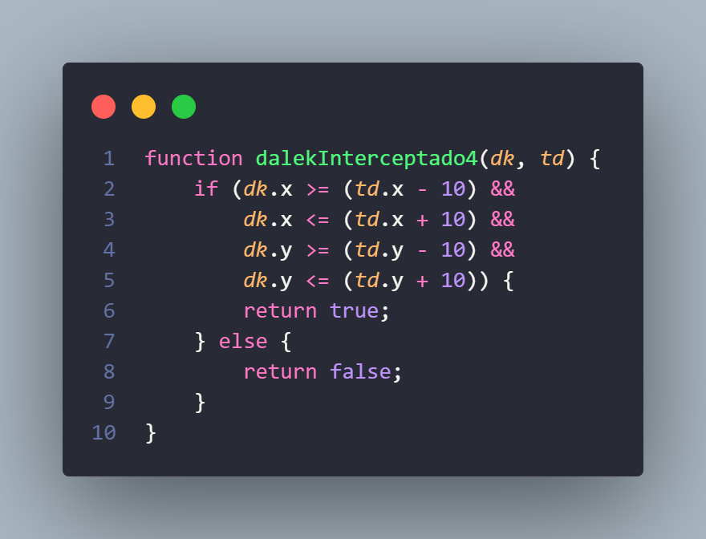

## Questão 1
O seguinte script faz parte de uma cena, e está diretamente relacionado à movimentação de um personagem. Independente do local inicial em que ele se encontra, indique qual alternativa representa a sua trajetória, simbolizada pelos TRECHOS de 1 até 4:

```JavaScript
var estado;
var velocidade = 100;
var passos = 0;
const MOVIMENTO = {
    TRECHO1: 0, TRECHO2: 1, TRECHO3: 2, TRECHO4: 3
};
var player;

function preload() {
    this.load.image('player', './assets/player.png');
}

function create() {
    estado = MOVIMENTO.TRECHO1;
    player = this.physics.add.sprite(450, 200, 'player');
}

function update() {
    var vetor_movimento = new Phaser.Math.Vector2(0, 0);

    if (estado === MOVIMENTO.TRECHO1) {
        vetor_movimento.x -= 1;
        if (passos >= 100) {
            estado = MOVIMENTO.TRECHO2;
            passos = 0;
        }
    } else if (estado === MOVIMENTO.TRECHO2) {
        vetor_movimento.y += 1;
        if (passos >= 100) {
            estado = MOVIMENTO.TRECHO3;
            passos = 0;
        }
    } else if (estado === MOVIMENTO.TRECHO3) {
        vetor_movimento.x += 1;
        if (passos > 100) {
            estado = MOVIMENTO.TRECHO4;
            passos = 0;
        }
    } else if (estado === MOVIMENTO.TRECHO4) {
        vetor_movimento.x -= 1;
        vetor_movimento.y -= 1;
        if (passos > 100) {
            estado = MOVIMENTO.TRECHO2;
            passos = 0;
        }
    }
    passos += 1;

    player.setVelocity(vetor_movimento.x * velocidade, vetor_movimento.y * velocidade);
}
```

### Alternativas

|  |             |          |                    |
|-------|-----------------|--------------------|------------|
| a)    |  | b)    |  |
| c)    |  | d)    |  |
| e)    |  |

[Clique para ver a resposta](#questão-1---resposta)

## Questão 2
Questão 7 - Um ser chamado 'Doutor' (Doutor quem?) de outra galáxia do 'Planeta dos Lordes do Tempo', precisa caçar e desativar seres malignos, meio biológicos, meio máquinas, os DALEKs, utilizando sua chave de fenda sônica. O Doutor, assim como os DALEKs, pode viajar no tempo e no espaço. Ele usa uma nave chamada TARDIS (Time And Relative Dimensions In Space) que também viaja para qualquer lugar no tempo e espaço. A TARDIS é equipada com um sensor capaz de detectar um DALEK em um raio de 10m. Considere o trecho de código abaixo, que representa uma rotina de busca, interceptação e captura de DALEKs:

function dalekInterceptado(...

Escolha a alternativa que represente corretamente uma função 'dalekInterceptado' que retorne verdadeiro ou falso caso a TARDIS intercepte um DALEK para poder capturá-lo. A nave 'TARDIS' será representada pela variável 'td' abaixo onde td.x seria a posição 'x' da nave e td.y seria a posição 'y' da nave no espaço. O 'DALEK' será representado por uma variável 'dk', onde 'dk.x' é a posição 'x' do DALEK e 'dk.y' é a posição 'y' do DALEK.

### Alternativas

|  |             |          |                    |
|-------|-----------------|--------------------|------------|
| a)    |  | b)    |  |
| c)    |  | d)    |  |
| e)    |  |

[Clique para ver a resposta](#questão-2---resposta)

# Respostas

## Questão 1 - Resposta

## Questão 2 - Resposta
Letra D


