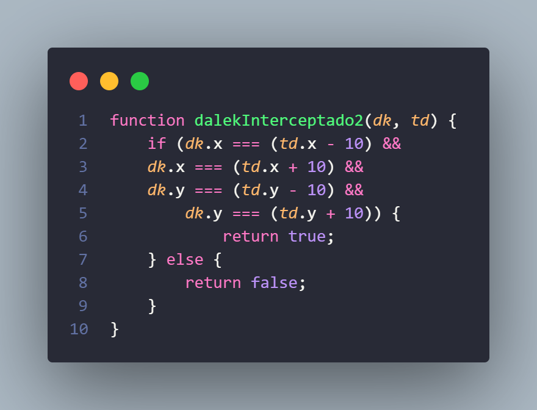

## Questão 1
O seguinte script faz parte de uma cena, e está diretamente relacionado à movimentação de um personagem. Independente do local inicial em que ele se encontra, indique qual alternativa representa a sua trajetória, simbolizada pelos TRECHOS de 1 até 4:

```JavaScript
var estado;
var velocidade = 100;
var passos = 0;
const MOVIMENTO = {
    TRECHO1: 0, TRECHO2: 1, TRECHO3: 2, TRECHO4: 3
};
var player;

function preload() {
    this.load.image('player', './assets/player.png');
}

function create() {
    estado = MOVIMENTO.TRECHO1;
    player = this.physics.add.sprite(450, 200, 'player');
}

function update() {
    var vetor_movimento = new Phaser.Math.Vector2(0, 0);

    if (estado === MOVIMENTO.TRECHO1) {
        vetor_movimento.x -= 1;
        if (passos >= 100) {
            estado = MOVIMENTO.TRECHO2;
            passos = 0;
        }
    } else if (estado === MOVIMENTO.TRECHO2) {
        vetor_movimento.y += 1;
        if (passos >= 100) {
            estado = MOVIMENTO.TRECHO3;
            passos = 0;
        }
    } else if (estado === MOVIMENTO.TRECHO3) {
        vetor_movimento.x += 1;
        if (passos > 100) {
            estado = MOVIMENTO.TRECHO4;
            passos = 0;
        }
    } else if (estado === MOVIMENTO.TRECHO4) {
        vetor_movimento.x -= 1;
        vetor_movimento.y -= 1;
        if (passos > 100) {
            estado = MOVIMENTO.TRECHO2;
            passos = 0;
        }
    }
    passos += 1;

    player.setVelocity(vetor_movimento.x * velocidade, vetor_movimento.y * velocidade);
}
```

### Alternativas

|  |             |          |                    |
|-------|-----------------|--------------------|------------|
| A)    |  | B)    |  |
| C)    |  | D)    |  |
| E)    |  |

<details>
  <summary>Resposta e Explicações</summary>

  ### Alternativa C
  
</details>


## Questão 2
Um guardião de alguma galáxia precisa caçar e desativar seres malignos, os DALEKs. Para isso, ele usa uma nave chamada TARDIS (Time And Relative Dimensions In Space) que viaja para qualquer lugar no tempo e espaço. A TARDIS é equipada com um sensor capaz de detectar um DALEK em até 10m de distância. 

Considere o trecho de código abaixo, que representa uma rotina de busca, interceptação e captura de DALEKs e escolha a alternativa que represente corretamente uma função 'dalekInterceptado' que retorne verdadeiro ou falso caso a TARDIS intercepte um DALEK para poder capturá-lo. 

- td = TARDIS
- dk = DALEK


### Alternativas

|  |             |          |                    |
|-------|-----------------|--------------------|------------|
| A)    |  | B)    |  |
| C)    |  | D)    |  |
| E)    |  |

<details>
  <summary>Resposta e Explicações</summary>

  ### Alternativa D
  
</details>


## Questão 3
O código abaixo possui um erro bastante comum de alunos de programação: a utilização de códigos desnecessários. Analise o código e marque a resposta que melhor explica o que o código faz e qual o comando desnecessário.
```JavaScript
let num = 100
let soma = 0
let cont = 0

for(let i = 0; i < num; i++) {
	cont+=i
	for(let i = 0; i < num; i++) {
		soma = cont;
	}	    
}
```

### Alternativas

|  |             |          |                    |
|-------|-----------------|--------------------|------------|
| A)    | O algoritmo soma os valores do índice “i” progressivamente. O comando FOR interno é desnecessário, apenas o comando soma=cont era importante. | B)    | O algoritmo soma os valores do índice “i” progressivamente. O comando FOR externo é desnecessário, apenas o comando soma=cont era importante. |
| C)    | O algoritmo soma os valores do índice “i” progressivamente. O código poderia ser substituído por cont=num, dado que a soma sempre será 100. | D)    | Dado que o valor inicial das variáveis “cont” e “soma” são 0, o código sempre resultará em 0. Desta forma basta apenas imprimir a variável soma. |
| E)    | O algoritmo soma os valores do índice “i” progressivamente, imprimindo o resultado a cada iteração do loop. Nenhum código necessita ser removido. |

<details>
  <summary>Resposta e Explicações</summary>

  ### Alternativa B
  
</details>


## Questão 4
Um código em Javascript foi implementado no objeto “Player”, que controla o sprite de cachorro, na cena abaixo. Considerando que tal código implementado é mostrado mais abaixo, selecione a alternativa que identifique o objetivo dele.


```JavaScript
class MainScene extends Phaser.Scene {
        constructor() {
            super({ key: 'MainScene' });
        }


        preload() {
            this.load.image('i', '../../assets/player.png');
        }


        create() {
            this.p = new Phaser.Math.Vector2(0, 0);
            this.v = 100;
            this.i = this.physics.add.image(this.p.x, this.p.y, 'i');
            this.t = this.input.keyboard.createCursorKeys();
        }


        update(time, delta) {
            let i = new Phaser.Math.Vector2(0, 0);
            if (this.t.right.isDown) {
                i.x += 1;
            }
            if (this.t.left.isDown) {
                i.x -= 1;
            }
            if (this.t.down.isDown) {
                i.y += 1;
            }
            if (this.t.up.isDown) {
                i.y -= 1;
            }


            if (i.length() > 0) {
                i.normalize();
            }

            this.p.x += i.x * this.v * (delta / 500);
            this.p.y += i.y * this.v * (delta / 500);
            this.p.x = Phaser.Math.Clamp(this.p.x, 0, this.game.config.width);
            this.p.y = Phaser.Math.Clamp(this.p.y, 0, this.game.config.height);
            this.i.setPosition(this.p.x, this.p.y);
        }
    }

```

### Alternativas

|  |             |          |                    |
|-------|-----------------|--------------------|------------|
| A)    | Fazer o cachorro seguir o mouse do jogador. | B)    | Movimentar o cachorro pela tela usando as teclas de seta do teclado. |
| C)    | Movimentar o cachorro até a casa. | D)    | Movimentar o cachorro até o osso. |
| E)    | Movimentar o cachorro até o osso e, após coletá-lo, movimentar o cachorro até a casa. |

<details>
  <summary>Resposta e Explicações</summary>

  ### Alternativa B
  
</details>


## Questão 5
Um jogador de SimCity, um simulador de criação de cidades, deseja saber qual das suas metrópoles possui a maior densidade demográfica. Para isso, cada cidade é armazenada em uma lista de apenas dois índices, na qual a primeira posição (`cidade[0]`) conterá o número de habitantes e a segunda posição (`cidade[1]`) conterá a área da cidade em quilômetros quadrados.
Para calcular a densidade demográfica (hab/km²), é necessário dividir a população pela área da cidade.

Estas pequenas listas de cidades serão armazenadas em uma OUTRA lista, que conterá todas as cidades.

Para encontrar a cidade com maior densidade demográfica, o sistema precisa de uma função que irá percorrer esta lista de cidades e retornar o valor da maior densidade demográfica.
Qual das opções abaixo representaria o código adequado para tal função?
